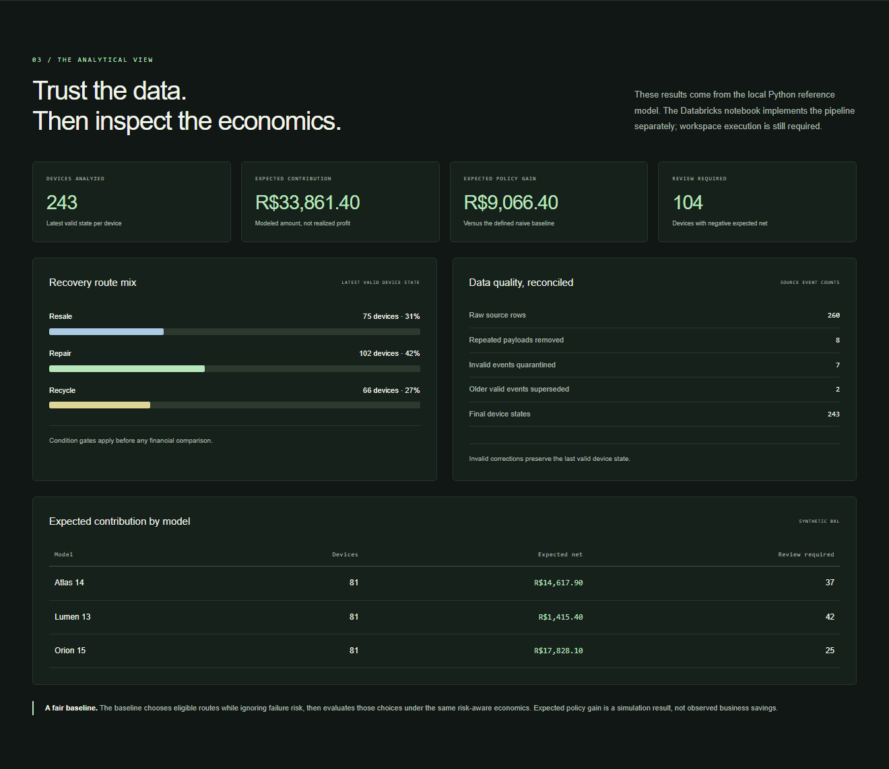

# Circular Intelligence

### A Databricks lakehouse for risk-aware equipment recovery economics

Repeated events, invalid prices and repair failures can hide the real economics of returned devices. Circular Intelligence turns raw equipment events into validated device state and explainable **resale, repair or recycling** decisions.

**PySpark · Delta Lake · SQL · Python Decimal · MIT**

*Browser dashboard using the local Python reference model. This image is not a live Databricks dashboard.*

[Case study](docs/CASE-STUDY.md) · [Setup](docs/SETUP.md) · [Architecture](docs/ARCHITECTURE.md) · [Validation](VALIDATION.md)

## Reproducible results

| Metric | Synthetic fixture result |
|---|---:|
| Source rows / latest valid devices | 260 / 243 |
| Duplicate / invalid / superseded events | 8 / 7 / 2 |
| Expected contribution | BRL 33,861.40 |
| Expected contribution vs baseline | +BRL 9,066.40 |
| Devices whose selected route changes | 46 |

The baseline chooses eligible routes while ignoring repair failure, then evaluates those choices with the same risk-aware economics. These values are modeled results, not measured customer savings. Full evidence is in [reference_results.json](data/reference_results.json).

## Run locally in one minute

Python 3.10+; standard library only. No account, API token or package installation is needed for the reference model.

~~~shell
python scripts/generate_data.py
python -m unittest discover -s tests -v
python scripts/check_repository.py
~~~

Open [docs/demo/index.html](docs/demo/index.html) in a browser for an offline interactive demonstration. The generator refreshes the CSV, JSON evidence and demo data. Local tests exercise the reference model, not Spark.

## What to review

| Capability | Implementation |
|---|---|
| Bronze → Silver → Gold | [Databricks notebook](notebooks/01_circular_pipeline.py) |
| Reproducible policy and data quality | [Decimal reference model](src/circular_model.py) |
| Synthetic events and corrections | [Data generator](scripts/generate_data.py) |
| Business-rule evidence | [13 reference-model tests](tests/test_circular_model.py) |
| Analytical tiles | [SQL dashboard queries](sql/portfolio_dashboard.sql) |
| Source values and semantics | [Data contract](docs/DATA-CONTRACT.md) |

## Architecture

~~~mermaid
flowchart LR
    CSV[Synthetic event CSV] --> Bronze[Bronze raw payloads]
    Bronze --> Quality[Validation and deduplication]
    Quality --> Quarantine[Rejected events]
    Quality --> Silver[Latest valid device state]
    Silver --> Gold[Route decisions and model summary]
    Gold --> SQL[SQL dashboard queries]
~~~

## Run in Databricks

Upload [the fixture](data/equipment_events.csv) to a Unity Catalog volume and import the notebook. Configure catalog, schema and input_path widgets, then run all cells. Requires compatible Databricks compute and permission to read the volume and create/write tables. Full assumptions and steps are in [setup](docs/SETUP.md). Run twice to verify replay preserves counts and financial totals.

## Databricks execution evidence

**Validated on Databricks Serverless on October 5, 2026.** The recorded workspace run completed the final fixture assertions: 252 unique Bronze events, 7 quarantined events, 243 Silver devices, expected contribution BRL 33,861.40 and gain against baseline BRL 9,066.40.

[Watch the recorded demo](docs/evidence/Circular_Intelligence_Demo.mp4) · [Final validation](docs/evidence/Circular_Validacao_Databricks.png) · [Gold results](docs/evidence/Circular_Resultados_Databricks.png)

The video edits an actual workspace recording. The fixture is synthetic and the financial values are modeled. This evidence confirms one completed execution; replay idempotency, production scheduling and separate SQL dashboard execution remain unverified.

## Verification status

**Checked locally:** 13 business tests, fixture reconciliation, deterministic outputs, Python syntax, JSON and documentation links, desktop/mobile browser demo.

**CI prepared:** repository checks, business tests and regeneration-drift checks. The workflow runs after publication; no hosted CI success is claimed yet.

**Confirmed in the recorded workspace run:** PySpark/Delta notebook execution on Serverless, table writes and final fixture assertions.

**Still required:** a second run to verify replay idempotency, separate SQL dashboard execution and production job orchestration.

## Deliberate boundaries

- Bronze ingestion uses MERGE; Silver scans the full demo event history and Gold is rebuilt.
- Invalid corrections preserve the last valid device state. Equal timestamps use hash order, not authoritative business sequence.
- Repair failure probability is an assumption, not a trained prediction.
- A live Salesforce connector, streaming deployment and production job orchestration are future extensions.

## Repository map

~~~text
notebooks/  Databricks PySpark and Delta pipeline
src/        Portable Decimal reference model
scripts/    Deterministic generator and repository checks
tests/      Business-rule tests
sql/        Dashboard queries
data/       Synthetic fixture and generated evidence
docs/       Case study, architecture, setup, contract and offline demo
.github/    CI and review templates
~~~

[Related Salesforce project](docs/RELATED-PROJECT.md) · [Contributing](CONTRIBUTING.md) · [MIT license](LICENSE)

All events, suppliers, device models and financial assumptions are synthetic. This is an independent portfolio project.

